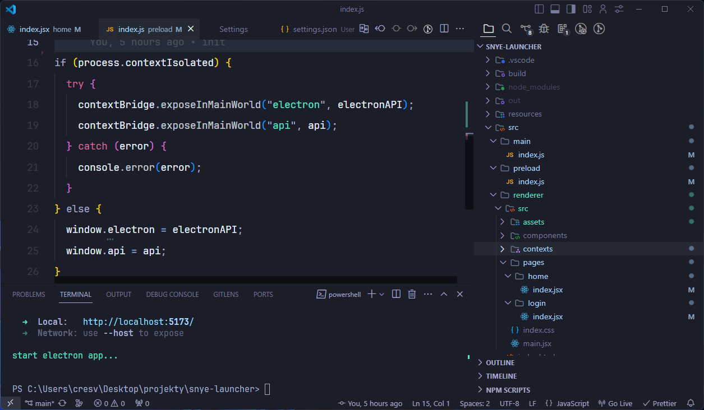

# 😍 My VSCode Setup

_(Showcase image)_

All [settings](.vscode/settings.json) and [extensions](.vscode/extensions.json) you find in [.vscode](.vscode) folder - Just copy this folder to your project and install all extensions.

## 🎨 Theme and icons

- Theme: `poimandres`
- Icons: `Symbols`

## ⚒️ Extensions

- `GitLens` — Git supercharged
  Id: eamodio.gitlens
  Description: Supercharge Git within VS Code — Visualize code authorship at a glance via Git blame annotations and CodeLens, seamlessly navigate and explore Git repositories, gain valuable insights via rich visualizations and powerful comparison commands, and so much more
  Version: 14.8.2
  Publisher: GitKraken
  VS Marketplace Link: https://marketplace.visualstudio.com/items?itemName=eamodio.gitlens

- `Astro`
  Id: astro-build.astro-vscode
  Description: Language support for Astro
  Version: 2.8.5
  Publisher: Astro
  VS Marketplace Link: https://marketplace.visualstudio.com/items?itemName=astro-build.astro-vscode

- `Better Comments`
  Id: aaron-bond.better-comments
  Description: Improve your code commenting by annotating with alert, informational, TODOs, and more!
  Version: 3.0.2
  Publisher: Aaron Bond
  VS Marketplace Link: https://marketplace.visualstudio.com/items?itemName=aaron-bond.better-comments

- `Carbon Product Icons`
  Id: antfu.icons-carbon
  Description: Carbon Product Icons for VS Code
  Version: 0.2.6
  Publisher: Anthony Fu
  VS Marketplace Link: https://marketplace.visualstudio.com/items?itemName=antfu.icons-carbon

- `CodeSnap`
  Id: adpyke.codesnap
  Description: 📷 Take beautiful screenshots of your code
  Version: 1.3.4
  Publisher: adpyke
  VS Marketplace Link: https://marketplace.visualstudio.com/items?itemName=adpyke.codesnap

- `EditorConfig for VS Code`
  Id: EditorConfig.EditorConfig
  Description: EditorConfig Support for Visual Studio Code
  Version: 0.16.4
  Publisher: EditorConfig
  VS Marketplace Link: https://marketplace.visualstudio.com/items?itemName=EditorConfig.EditorConfig

- `Error Lens`
  Id: usernamehw.errorlens
  Description: Improve highlighting of errors, warnings and other language diagnostics.
  Version: 3.16.0
  Publisher: Alexander
  VS Marketplace Link: https://marketplace.visualstudio.com/items?itemName=usernamehw.errorlens

- `ES7+ React/Redux/React-Native snippets`
  Id: dsznajder.es7-react-js-snippets
  Description: Extensions for React, React-Native and Redux in JS/TS with ES7+ syntax. Customizable. Built-in integration with prettier.
  Version: 4.4.3
  Publisher: dsznajder
  VS Marketplace Link: https://marketplace.visualstudio.com/items?itemName=dsznajder.es7-react-js-snippets

- `ESLint`
  Id: dbaeumer.vscode-eslint
  Description: Integrates ESLint JavaScript into VS Code.
  Version: 2.4.4
  Publisher: Microsoft
  VS Marketplace Link: https://marketplace.visualstudio.com/items?itemName=dbaeumer.vscode-eslint

- `Firebase`
  Id: toba.vsfire
  Description: Firestore Security Rules syntax highlighting
  Version: 1.4.1
  Publisher: toba
  VS Marketplace Link: https://marketplace.visualstudio.com/items?itemName=toba.vsfire

- `Font Changer`
  Id: talhabalaj.actual-font-changer
  Description: Quickly changes fonts by selecting from a installed fonts
  Version: 0.0.10
  Publisher: Talha Balaj
  VS Marketplace Link: https://marketplace.visualstudio.com/items?itemName=TalhaBalaj.actual-font-changer

- `Live Server`
  Id: ritwickdey.LiveServer
  Description: Launch a development local Server with live reload feature for static & dynamic pages
  Version: 5.7.9
  Publisher: Ritwick Dey
  VS Marketplace Link: https://marketplace.visualstudio.com/items?itemName=ritwickdey.LiveServer

- `Prettier` - Code formatter
  Id: esbenp.prettier-vscode
  Description: Code formatter using prettier
  Version: 10.4.0
  Publisher: Prettier
  VS Marketplace Link: https://marketplace.visualstudio.com/items?itemName=esbenp.prettier-vscode

- `Quokka.js`
  Id: WallabyJs.quokka-vscode
  Description: JavaScript and TypeScript playground in your editor.
  Version: 1.0.634
  Publisher: Wallaby.js
  VS Marketplace Link: https://marketplace.visualstudio.com/items?itemName=WallabyJs.quokka-vscode

- `Tailwind CSS IntelliSense`
  Id: bradlc.vscode-tailwindcss
  Description: Intelligent Tailwind CSS tooling for VS Code
  Version: 0.10.5
  Publisher: Tailwind Labs
  VS Marketplace Link: https://marketplace.visualstudio.com/items?itemName=bradlc.vscode-tailwindcss
